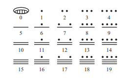

# History of mathematics

## Incas
- used a series of knots: quipu
- base 10
- positional based (litterally base 10 brinary excepts its 1's, 10's, 100's, etc)

## Mayans
- used lines and dots
- base 20 (vigesimal)
- had a modified base 20 system
- the third digit was x * 18 (this makes numbers that line up with their calendar nicely)

## Babylonians
- used base 60 (sexagesimal)
- reads like binary (least to most significant)
- eventually came up with symbols represent `nothingness`

## Egyptians
- went through several stages in writing system
	- these were not used often (archaic/old egyptian) since it was just very old and pretty bad

